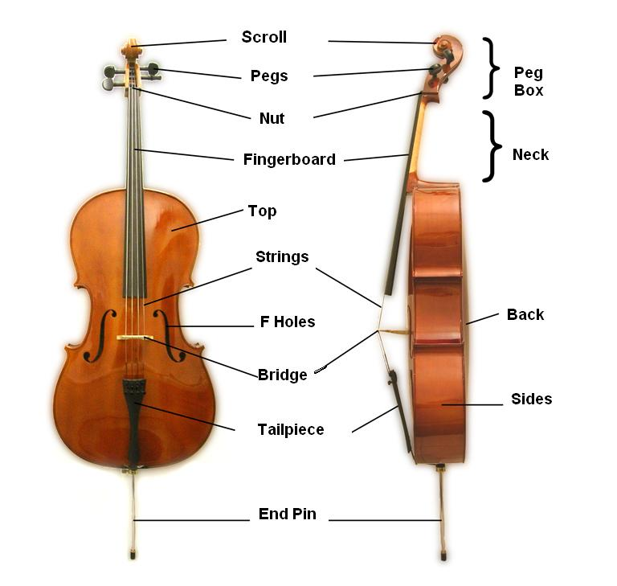
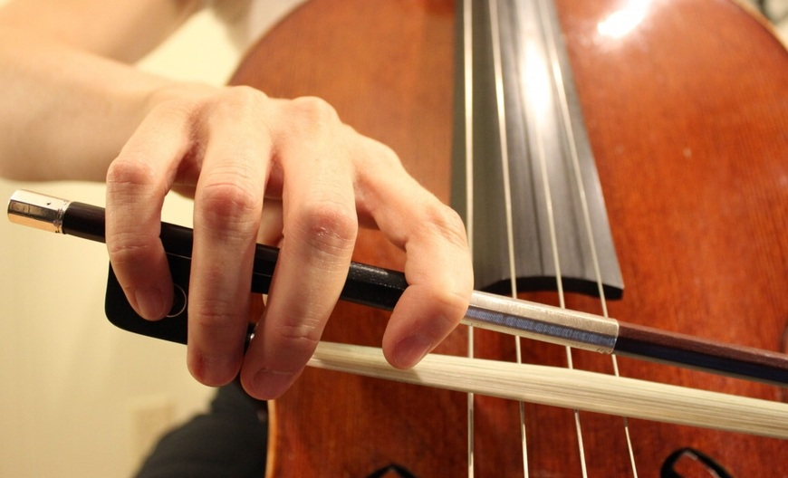

Do you remember Harry’s visit at the Ollivander’s wand shop? Young wizard tried multiple wands: willow, oak, maple, and with different cores: unicorn’s hair, phoenix feather. Nothing gave a spark until a wand made from holly wood with dragon heartstring. Ollivander was very perplexed by this match [^1], but he quickly got his coolness back, saying “The wand chooses the wizard, Mr Potter”. It is strikingly similar to what cello professionals are saying about bow: as an extension of their arm, it is the bow that chooses the musician. And bow is my greatest nemesis when learning the instrument. 

Slightly more than a year ago I started learning cello. With ~100-150 hours of cello in my body, I would like to reflect on the process of producing  clear sound. It is probably the only advantage I have over a child learning an instrument: I can analyse the elements through the lens of my earlier experiences, and describe them as such. Not the form of expression I am learning to build, but always something.

For starters, cello is the big violin-like instrument you need to put on the floor. Consequently, instead of a chinrest, it has a pin: the metal appendage to position on the ground. It gives the first point of support, the remaining ones are created with the cellist’s body. You hold it with your legs, slightly above your knees. The neck gets supported by your chest. When playing, the instrument gets additionally fixated in space by your left hand, that is by pressing the strings against the fingerboard. The last point of contact comes from the bow, operated by your right hand. The ultimate test of right positioning is that the ebony pegs on which the strings are rolled should not land in your face. The issue is as old as the first modern cellos, and some cellists handled it decisively [^2]. Notably, symmetry of the instrument is roughly matching symmetry of the player’s body. The symmetry match is not the case for the bow, however. 

::: {#fig1-cello-parts}

Elements of the cello. [Source: Wikipedia](https://en.wikipedia.org/wiki/Cello#/media/File:Cello_Parts.jpg)
:::

Jeckyll and Hyde, cello and bow. The bow revolutionised string instruments, as it allows string to vibrate far longer than simple plucking (plucking is what you do with a guitar [^3]). That’s about all good I can say about the bow. I felt in love with the cello because of the sound produced with the bow, and I hate this magic stick at the same time. Why? Because it is so hard to hold, and it is even harder to hold it and produce decent sound for couple of minutes straight. But more on that later. 

To hold the bow, thumb pairs with the middle finger. Against teens of millions years of evolution but consistent with what you need to do with your left hand [^4]. The actual hold of the bow is done by index and thumb, though, as index wraps around the grip. Another word of criticism is that the bow, even though round the world is hold in the right hand, is achiral. Achiral means it has symmetry. Completely unnecessarily. For firm grip and comfort, it should be chiral – that is, profiled for the right hand. When you have a decent glove, the glove for right hand fits your right hand but not the left one. Gloves are chiral [^5]. And this is universal criticism. All my other complains probably hold to student bows that are more manufactured than made, and for now I will keep them for myself. 

::: {#fig2-bow-grip}

Holding of the bow. [Source: TomPlay](https://tomplay.com/fingering-charts/cello)
:::

Naturally, the cello needs to be tuned.

There are two entry points to tune the cello, an easy one and a hard one. If the instrument is slightly out of tune you are lucky and you can use fine tuners, the little screws close to the bridge. But if the instrument hasn’t been used for a while or the string got loose in transport, you have to use pegs. In such case I spend the time I was planning to practice just to tune. And not always succeed. It is still on a good day. On a bad day it happens to break a string, though. Be aware: it is not because I tune with my ear only, I use external tuner, but tuning with pegs is a very tedious process for a beginner.

Keep in mind we haven’t made any sound so far. 

To produce sound with an open string, we first need to tense the bow hair and apply rosin for proper grip. When you stroke the bow over the string, you should do it at 90^o^ angle. Not that anybody will come to measure, no one has to. With four strings, there is not much freedom to play one string without playing the other, and it is why this accuracy is crucial. Also, you need to acquire this peculiar positioning of your arm and elbow, slightly different for each string, and learn to switch between them. Probably you have heard about the tennis player elbow. There exist the cello player elbow, too. Yes, you can get injured by playing a musical instrument. Similar as in sport, acquiring decent technique is not only a way to succeed as an individual player, but also to avoid injuries.

Mind that we still operate with a single hand only. To play notes different than do, sol, re and la [^6], we need to start pressing the strings in the correct positions. For that we use left hand.

Left hand is for the fingerboard – it is the one that is left (punch unintended), while right hand is operating the bow. Let’s say that we want to play do-mi-sol-do’, with 2nd do being an octave higher. A cellist junkie chord. Notice that 1st and 3rd notes are open strings, we only need to press strings for mi (ring finger) and do’ (pinky). It is played in the so-called first position, with the left hand operating close to the end of the neck. Here I try to describe the positioning of the fingers, so please, bear with me in the next paragraph. 

Thumb goes behind the fingerboard, roughly opposite the middle finger. This is where cello betrays our evolutionary wiring: primates evolved pincet grip between thumb and index, and now you have to unlearn it. All the remaining fingers come down on the C string. Then comes the stretch: pull index and ring far apart, farther than feels reasonable. When it starts to hurt, stretch just a bit more. Hold that distance and press the C-string with the index. If you’re lucky, a mi comes out. Sol is easy, as it’s an open string, small victory. For do’, the index finger migrates to the G string, perpendicular to the nut, while the pinky drops only a touch beyond the ring. In contrast to index-ring, the ring–pinky gap doesn’t hurt at all. The problem is strength: the pinky is so feeble it can barely press the string. Luckily, but just for a moment, the other fingers might pitch in and share the load of the pinky. And there it is: do–mi–sol–do’.

::: {#fig3-first-position}

Right hand in the first position. [Source: TomPlay](https://tomplay.com/fingering-charts/cello)
:::

I did not say where exactly to place the fingers. Well, cello has no frets to designate positions of the notes, as eg. guitar does. Given that your cello is tuned, you find the correct positions in relation to the sound of the open strings. Or, putting it bluntly, you just need to hear. 

Funny enough, positioning of left hand is so unnatural that just searching for these few elements allows you to spot fake cellists in the pictures or in the movies. Even pretending requires training.

And here we come to the “at once”. 

So far I have described individual aspects of playing cello as being physically uncomfortable, unnatural or demanding. Or just bow construction being primitive, and not refined for the centuries. Well, it was just nagging of the novice, as the real challenge is to put all these elements together. Posture, left hand, right hand, rhythm, melody, articulation [^7].

All good sounds are the same, all bad sounds are bad in their unique way. Given all these elements, and few more, contribute to the sound quality, it is enough to mess up just one to produce inferior sound.  

In “Thinking Fast and Slow,” Daniel Kahneman, American-Israeli psychologist who won the 2002 Nobel Prize in Economics, discusses his early research involving pupil dilation. Together with his grad student Jackson Beatty they build on the fact that the more cognitively demanding the task is, the more dilated the person’s pupils are. Well, if they were to observe me playing a simple cello piece they probably wouldn’t be able to say the colour of my eyes. I don’t think I ever did anything equally difficult in my life. 

Then why the hell am I doing it?

Starting from a simple but noticeable detail: at least contemporary cellos have the pin. The baroque cellos did not have that, and probably the cellists who performed for Bach his six cello suites could crack nuts with their knees. Tiny detail, but meaningful. I wonder if I will experience such touch of genius for bow construction, too. 

Not that it matters too much in the world of sounds, but cellos are aesthetically pleasing. Shape, colour, symmetrical appearance. Among cellists, there is high appreciation of varnishing and 300-year-long discussion on how it affects the instrument’s sound. It seems that preparing varnish in the past was advanced potion making, but today no one has the book, forget the Snape’s annotations. 

And here comes the real argumentation.

Cello is the most versatile musical instrument with the most soothing register. The register is similar to human voice, which on its own gives this comforting feeling of familiarity. The well produced sound has warmth, depth and pitch that just feels good. Within the string, besides its length, there are practically no limitations: you can play a continuous glissando, which sounds like a fire brigade. You can play _pizzicato_ [^8] by pulling the strings with your naked fingers, you can play with the bow. You can even pluck as you would do with acoustic guitar! You can modulate the note, giving it even more warmth and depth, when playing vibrato. 

We humans like stories. And the cellos have stories like no other instruments. Cellos survive cellists. Best instruments are passed from musician to musician. The better cellist you are, the more you are a cellist of the cello than it is your cello. Moreover, cello is mechanical instrument, build up of a fairly few elements. As such the cellos get better with time. Show me a profession in which tools fulfill these three elements: get better when being used, are passed from generation to generation and rise in value in time [^9].

In addition, cello is mobile. Being mobile increases chances of being part of some exceptional performances, concert halls, musicians, conductors. Imagine playing the same instrument that recalls the times of Bach, Mozart and Brahms, or perhaps was even played in their presence. And then realize that this instrument will survive you and will sound even better in the years to come... Even if you don’t play such instrument yourself, you’re still part of the community. You can enjoy their performances in the concert halls— as a dirty distant cousin to the main star, but you belong nonetheless.

Finally: when you play lower strings, like C and G you __feel__ vibrations of the instrument. The sound resonates with your body. It can really make you a junkie. In the intimate hold you have with the cello (remember multiple support points, knees, chest and hands?), the energy of the sound is propagated through your body. Therefore, you not only produce sounds, you literally emit them. Sorry my violinists friends, check mate.

I wish to get to the level when it will make sense to change the bow. Until then, I collect my little wins over the instrument. Strong sound made with the pinky. Clean transitions between strings. Smooth legato. There is so much to collect. Thank you for reading.



[^1]: You-Know-Why.
[^2]: [Trying 300 Year Old Cello & Jacqueline Du Pre's bow in London!](https://www.youtube.com/watch?v=siB-jy_EwUI)
[^3]: Keep in mind that in the guitar all strings are placed in the same plane, parallel to the fingerboard. Playing the guitar with the bow, you would play all strings at once. Strings in the cello are positioned on a semi-circle and thanks to such construction you can play them separately.
[^4]: If it comforts anyone.
[^5]: It is different in the case of highly elastic laboratory gloves where each glove from the box fit both hands equally well. Yet, “elastic” is the last adjective you can use to describe the bow.
[^6]: Remember the scale, do-re-mi-fa-sol-la-si-do? It is spanning a single octave. Four strings in the cello span almost two octaves, as the string to the left is dominant to the preceeding string: __do__-re-mi-fa-__sol__-la-si-do-__re__-mi-fa-sol-__la__-si-do.
[^7]: I remember once I was playing a melody with _legato_ articulation, which means more than one note with a single stroke of the bow. I wasn’t doing well, so my teacher switched the gears, “let’s play it _détaché_", she  . She almost made my head to explode. Then she said the intention was to change to an easier articulation. -> no 4h PhD defense, no job application, no experiment planning and execution on equipment worth 100x more than my cello. Switching from legato to _détaché_ on the top of all the other elements I was trying to control at the time. It almost blow my mind.
[^8]: _Pizzicato_ and pizza have the same etymology!
[^9]: These arguments apply to violin, too. Sure. But as a mother of three, I could not stand one more source of high pitch under my roof. It is all about the pitch.
