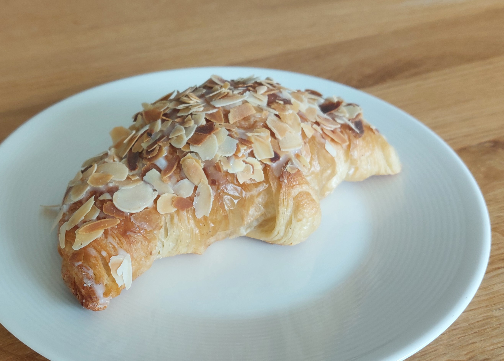
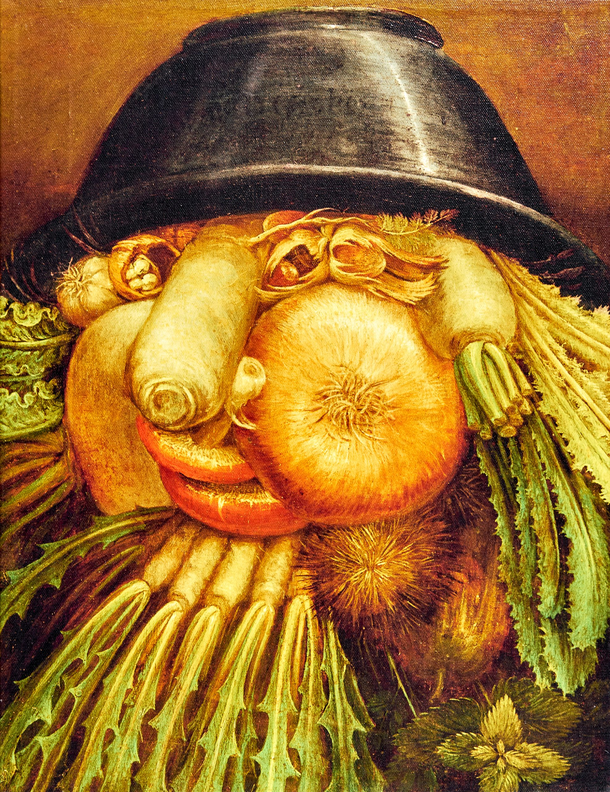

Halfway between the nursery and home, I am often caught by the red light. The moment I hit the break, the scent of melted butter is coming to my nostrils. Coincidentally, the ventilation pipe outlet from the nearby bakery is going to this side of the street. In an instant, I am facing the choice: wait on the red light or turn right and grab something for breakfast[^1]? The bakery is run by a couple of elderly people, probably married for +50 years. The work distribution is crystal clear: she is serving the clients, he is doing the baking.

If you take the right spot for a coffee, you can see through almost all working stations in the humongous open kitchen. You can follow all steps: from separation of egg’s yolk, through melting the butter, mixing with flour, until decoration with powder sugar. While you can notice some helpers to the wife, the husband is always working alone. Stradivari of croissants with almond dressing.

::: {#fig1-crossaint}

Work of art from my Baker.
:::

As I recently read “Stradivari’s genius” by Toby Faber, I realized that my baker has a lot in common with the Italian master violin maker. Both work professionally at the very advanced age. Both are excellent in their respective fields. And neither is surrounded by (many) apprentices, to pass on the secrets of the craft to the next generations.

The book by Faber follows in time six instruments made by Antonio Stradivari. Starting from the bench in the Cremonese workshop we follow Viotti, Paganini, Davidoff, Messiah, Khevenhüller and Lipiński for three centuries, around the world, when they are witnessing, and sometimes even making, history. What I would like to focus on in the today’s post is the personage of the master craftsman, Antonio Stradivari. During his ninety-three year long life, he made +1000 violins and +100 cellos, of which ~300 and ~60, respectively, survive to this day[^2]. He was a dedicated experimenter, who, so to speak, directed the evolution of violins[^3] and arrived at the model that is the blueprint of today, almost 300 years after his death. Nowadays, his instruments are sometimes even more famous than the musicians who play them. The contribution of Stradivari, as compared to the earlier luthiers, is strong, penetrating sound of his instruments, suitable for big concert halls[^4]. Aside from his astonishing achievements as a craftsman, what fascinates me most is Stradivari's role as a teacher — or the kind of teacher he might have been.

In his 70+ years as a luthier, Antonio Stradivari had for sure two apprentices: Francesco and Omobono. Surprise, surprise, they were his sons. Within a prosperous family business, it has always been customary to train children in the trade. However, his teaching activity seems very limited. Antonio had eight children who reached adulthood, spent seven decades at the workbench, and himself started as an apprentice at a non-family workshop[^5]. Although reconstructing a person’s life long after their passing is inherently challenging, it is evident that there was sufficient time to train more than two luthiers. He could have taught more of his own children or accept apprentices outside of his family; the notion of training someone beyond his relatives must have been present in his mind.

Music historians have determined, based on how the scrolls were cut, that Francesco was given the responsibility of crafting this part of violins in 1699, at the age of 27. The scroll is a decorative piece of the instrument which does not impact its sound. By comparison, the father made his first violin (the latest) at the age of 22. For the younger Omobono it is even harder to evaluate his works. Since the instruments made by the father were selling best, it was common practice to relabel works of his sons and this way boost profits. These historians have also concluded that Antonio delegated cello making to Francesco only in 1727, same year he commissioned the stoneman for his gravestone. He was ready, but the reaper came only seven years and few violins later. 

Stradivari’s will, its initial and final versions, is one of the few surviving documents written by the great luthier. In both versions the entire workshop, house and instruments was passed to Francesco. Also, in both versions the father reduced the financial allowance he left to Omobono by the debt he made with a trip to Naples in his twenties. The difference between 1.0 and 1.1 was that in the former Omobono was allowed to keep craftsman tools of his choice.

Families... Was passing everything to Francesco a traditional practice of giving all assets to the eldest son? Or, in terms of the workshop’s future, was it choosing the lesser of two evils? Otherwise, if Antonio had trust in Francesco, why he was so reluctant to delegate any responsibility to him pre mortem? The father’s longevity was not shared by his sons: they both died within a decade after Antonio. None of them had children, none of them took any apprenticeship. 

As a result, the supply of exquisite violins was cut permanently. Antonio could not predict how long his sons would outlive him, but did he have confidence that they—especially the oldest Francesco—could manage and sustain the workshop's legacy? Was he even bothered about it, or maybe he just wanted to make exquisite violins? Same as my baker wants to make best crossaints?

On the other hand, isn’t it sort of harsh to expect from someone who is excellent at his craft, to do something completely else, like teaching?

Why do we assume that someone who has consistently excelled at his job, has extensive knowledge in a certain field, and (ideally) is also an experimentalist who continuously improves his methods, will be also good at delegating, motivating and mentoring?

An analogy to the academic world is so evident that I cannot avoid it here. In many countries, the dominant path for a researcher to stay in academia and to continue testing his ideas, is to become a tenured professor[^6]. However, professorship comes with group leader responsibilities, which is noting else than managerial duties. And here is the great clash: a researcher offered a professorship is selected on soloist criteria: individual excellence in research, competitiveness and achievement in publishing process and solo performances on renowned conferences. Once successful, he is supposed to do something completely different: delegate, motivate and drive subordinates to deliver. By no means to carry out any research by himself. 

In nature, the natural selection operates. Frances Arnold pioneered the whole branch of research where directed selection is in power [see: Caveman Baby](https://excellentproblem.com/posts/2026-01-15-caveman-baby/). In academia lunatic selection is used instead. Imagine a species is selected based on his ability to digest a stringy plant, the only source of energy in the academia biotope. Once the worse chewing opponents die out from hunger, the world turns dark. Now our master chewer will only survive if he has decent night vision. But he does not need to worry about the food, it will be brought to him, half-cooked even. 

As a great admirer of Darwinian evolution, I totally love works of Arnold and dislike the underlying forces in academia. On the other hand, I see that making researchers team leaders, same as making subject matter experts the managers and expecting my baker to have a network of bakeries that he overlooks, is a common way of scaling people. How else to increase somebody’s sphere of impact, if not by making him more influential? Such move, if successful, is best in terms of value creation for society, community and company. But is it good for the individual under question? Is he even capable to fulfill hid new duties? How many exceptional soloists from the symphonic orchestra make decent conductors? Selection process to be efficient should, at least partially, select for the feature of interest.

Surely, people are not one dimensional: they have different talents and they can learn. Plus, there are many examples of outstanding teachers and managers that were exceptional individual contributors first. However, not all roots grow horizontally, some go deep into the soil instead. Or even become storage organs. And all three are examples of growth.

::: {#fig2-taproots}

Vegetables or Gardener? Turn the picture upside down. By Giuseppe Arcimboldo, 1590. What a coincidence that it's on display at the Museo Civico Ala Ponzone in Cremona?!? [Source: Wilheml Fabry Museum webiste](https://wilhelm-fabry-museum.de/wp-content/uploads/2022/10/Kinderartothek-Arcimboldo-Gemuesegaertner-600x779.jpg)
:::

Messiah, the 1716 violin from the gold period of Antonio Stradivari, is on display in Ashmolean Museum in Oxford, as “a yardstick for contemporary violin makers” [^7]. Even though Stradivari lived for almost 30 years after its completion, he has never sold the reddish violin. Also, it was never sold by Francesco, his oldest son and the sole heir. The first buyer of Messiah was Count Cozio, a collector who bought it from Paolo, heir of Francesco and his youngest half-brother. Apparently neither when in possession of Stradivaris nor of Cozio the instrument was played. It enabled to keep the remarkable varnish intact for almost hundred years, making the instrument look as if it dried out the day before on a rooftop terrace in Northern Italy. Such characteristic could successfully intimidate generations of violinists and therefore Messiah remains the mythical instrument, for most of the history appreciated by its displayable features, and not of its tone. As Messiah exhibits some features that make it doubt it was made by Antonio Stradivari[^8], it was a subject of multiple studies trying to determine its age, that can be politely summed up as inconclusive. However, Toby Farber gives it an excellent twist: 

_“In 1716 Giovanni Battista, the eldest son from Stradivari’s second marriage to survive infancy, was thirteen, just the sort of age when, after maybe two years in the workshop, a fast learner might have expected to have a hand in his own instruments. If Messiah was one of them, then never mind the implications for the violin; consider what it says about Giovanni Battista. Generations have hailed the Messiah as a masterpiece and its maker as a genius. Perhaps, if Giovanni Battista had not died in 1727, aged only twenty-four, Antonio Stradivari would have a worthy successor after all”._

Thank you for reading.

[^1]: Best marketing ever, and I am pretty sure it is unintentional. 
[^2]: And 10 violas. Source: Carlos Prieto, “Adventures of a cello”. 
[^3]: Interestingly, there was not so much experimentation for cellos: to make the bigger instrument it requires more time and physical effort. In contrast to violins, it is unlikely that Stradivari made cellos in his spare time; he made the cello only when contracted to make one. At that times these who could afford to commission the cello were kings, popes or opera impresarios. Also, for cellos the poll of noteworthy craftsmen was greater, and it was centred in another northern Italian city, Venice. To mention just a few remarkable Venetian cello makers: Montagnana, Goffriller and Guarneri – their instruments are often of choice of contemporary top cellists. 
[^4]: Given that the wood needs to age for the instrument to get its best tone, Stradivari must have had an excellent acoustic intuition and ... a bunch of luck when selecting wood. Unless he could project how the wood will age in 50 years.
[^5]: there exist a violin that binds Stradivari with another great Cremonese luthier, Nicola Amati, by mean of the label. However, lack of data on Antonio living in Amati’s house during the plausible apprenticeship divides the community on whether Stradivari learned at Amati or not.
[^6]: By saying dominant, it does not mean that it is available for a big number of candidates. It only means that it is the most common path for these who stay in academia and become independent researchers.  
[^7]: as advised by the Hills, a family who donated Messiah to the Oxford’s museum.
[^8]: Eg. cut of the sound holes and asymmetry of the scroll. For more read the already mentioned excellent book of Toby Farber, “Stradivari’s genius”.

