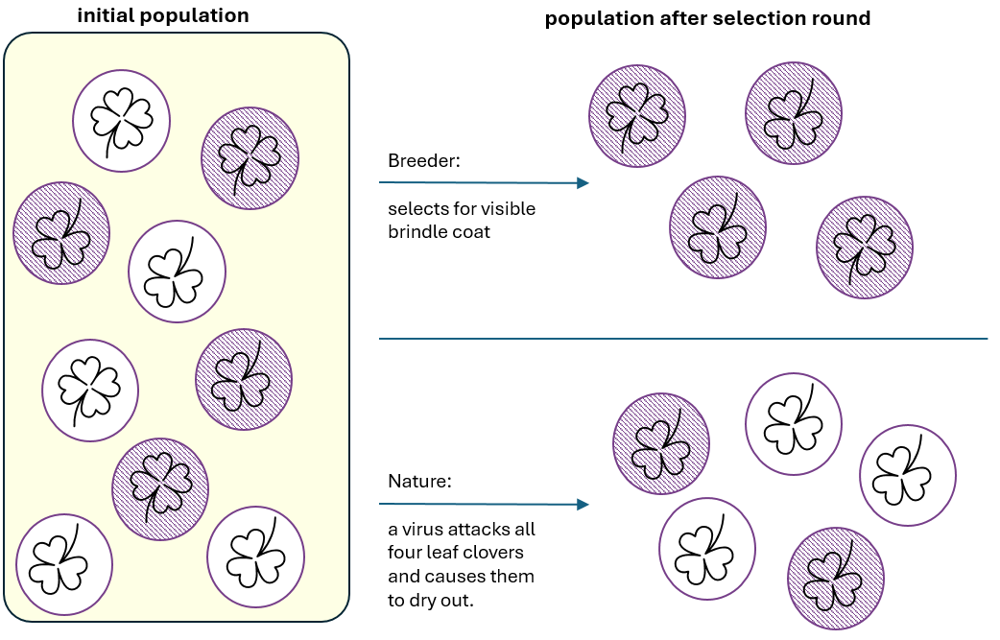

For more than 20 years, Charles Darwin was seduced by a contrast. It was the contrast that became foundational for evolutionary theory that was just birthing in his head. It is the contrast that is still causing misunderstanding of evolution and provides arguments to its sceptics. Namely, Darwin proposed that a mechanism of natural selection is a driving force behind evolution of living organisms. The powerful comparison juxtaposed artificial selection with natural selection. 

::: {#fig1-art_vs_natrure}

The powerful contrast: artificial selection (top) vs. natural selection (bottom). Each circle represents a horse with two characteristics: type of coating and ability to digest particular type of clover. 
:::

Let’s read Darwin’s words firsthand, from a letter when he was persuading his fellow naturalist Asa Gray to his theory[^1] - still before publishing the Origin[^2]: 

_'It is wonderful what the principle of Selection by Man, that is the picking out of individuals with any desired quality, and breeding from them, and again picking out, can do. Even Breeders have been astonished at their own results.(...) Now suppose there was a being, who did not judge by mere external appearance, but could study the whole internal organization— who never was capricious,—who should go on selecting for one end during millions of generations, who will say what he might not effect! (...) I think it can be shown that there is such an unerring power at work, or Natural Selection (...) which selects exclusively for the good of each organic being.'[^3]_

Do you see the issue? A mechanism that is blind and has no purpose is called selection. Selection has same root as election. Selection implies agency. And Mother Nature simply does not care.



Although the message from Julia Roberts was not heard by Darwin, it is the same type of feedback he got from many of his contemporaries. Everyone from the fellow discoverer of evolution Alfred Russel Wallace to his own publisher came up with objections: 

_Others have objected that the term selection implies conscious choice in the animals which become modified; and it has even been urged that as plants have no volition, natural selection is not applicable to them![^4]_

The latter was a remark made by a British zoologist John Edward Gray. Touched by the review, Darwin later complained that J. E. Gray understood the Origin 'no more than a pig does'[^5]. 

Agency of nature was precisely the implication Darwin was trying to avoid. Even though, reception of criticism was always a rare feature[^6]. The term “natural selection” was so embedded in Darwin’s own thinking that he chose to stick with it and use in the 1st edition of the Origin. Then, years have passed, the book was read by many more than Darwin’s pen friends and confusion caused by “natural selection” only grew. In his later correspondence he admitted that it was a poor term choice and even considered to change it to “natural preservation” or “survival of the fittest”. At the same time, he decided that it is too late for the full swap, as the book was already released[^7]. I wonder what decision he would have made if he had known that the theory of evolution would become a cornerstone of biology, be beautifully complemented by Mendel’s work on inheritance, and reach far beyond his imagination — eventually shaping our understanding of the origins of life at the molecular level. Would he still have stuck with a term that everyone around him said was confusing, simply because it helped him shape his thinking?

Nowadays, we are once again confronted with the natural-versus-artificial divide. Natural is also called human or biological or just no-adjective-is-attached. Intelligence. This time, I have no problem with the noun, but with the adjective.

There is inferiority in “artificial”; artificial is fake. The word “artificial” has the same root as “art” – but try to tell to an artist that he produces artificial works. Also, juxtaposing artificial with human intelligence creates opposition, and opposition is a chance for conflict. I rather prefer the expansion of AI proposed by Yuval Noah Harari in Nexus: alien intelligence. AI is not faking human intelligence, it is just different. Same as plains are not artificial birds. 



Despite all the progress in AI in recent decades, the points Feynman made 40 years ago remain valid. Human intelligence is shaped by millions of years of evolution on the planet Earth and just this makes it irreplicable. But irreplicable is not the same as unreachable. Human intelligence serves survival pretty well and as a byproduct we enjoy apparent dominance over other species[^8].

Yet, many decisions we make are dictated by instincts. And instincts are often binary. Fight or flight, friend or foe, black or white, there is not much space for weighting and gray scale. On the other hand, alien intelligence thrives on a gray scale and avoids extrema. When we decide “left, not right”, AI assigns probabilities. From this perspective humans and AI could be considered complementary. And this is how I choose to think about it.

As a chemist, I choose to think about AI as a potent new chemical. It will interact with many compounds, and as a result new entities will be produced. Still, the products will be composed of the same elements that were in substrates: conservation of mass and law of definite proportions hold true, we are still in the same reality. Also, rather than irreversible reaction (that would mean only products in the pot), I expect a certain equilibrium between products and substrates.
$$\ce{C2H5OH + CH3COOH <=> CH3COOC2H5 + H2O}$$
[A kitchen table example of a reversible reaction is estrification: mixing vodka with vinegar, with a few drops of car battery acid will produce a fruity smelling ester. Because the reaction is reversible, you will smell three scents at once, because all reagents will be present. Similar for human-AI hybrid, it will coexist with humans and AI.]{.figure-caption}

As an investor, I choose to think that AI will not cause mass unemployment. Imagine a publicly traded company that can, thanks to AI, do the same work it was doing recently but twice as fast. The company then faces a choice. One option is to lay off half of its employees, keep output constant, and save on compensation. Earnings would not grow, but costs would fall. Translated into investor gains, the pie would become only slightly larger, expanded by what used to be employee compensation. Alternatively, the company could retain its workforce and, with the same number of employees, double the size of the pie[^9]. Which option would shareholders vote for?

And as a working professional… Today is the 1st of May—Labor Day—and a national holiday in much of the world. To recall the origins of this holiday, we commemorate the victims of the Haymarket affair, which took place 140 years ago in Chicago. On May 1, 1886, hundreds of thousands of workers across the United States went on strike in support of the eight-hour workday. On the third day of the strike, tensions escalated at the McCormick plant in Chicago, and what had until then been a peaceful rally turned violent, with clashes between workers and the police. Depending on the source, between two and six McCormick workers were shot dead by police officers[^10].
The rally held the following day at Haymarket was organized in response to these events and was intended to be peaceful. It remained nonviolent until someone threw a bomb that killed a police officer. The events that followed set the eight-hour movement back, as its demands became associated with anarchists and were largely ignored. Interestingly, these Chicago events are commemorated in more than 150 countries worldwide—but not in the US.

What was the paragraph above all for? Let me start again. As a working professional, I would be more than happy if gains in productivity attributed to AI would translate to a shorter working day. Eventually, [time is the resource that matters the most.](https://excellentproblem.com/posts/2026-04-18-countable-events/)

It looks that my statements are contradicting each other. Investor or employee? Fight or flight, friend or foe? Likely investor and employee, both with fractional contributions to the big picture. I do not opt for a single scenario, because in reality edge cases are extremely unlikely. Thank you for reading. 

[^1]: I chose this letter and not the book itself, because in the letter Darwin is still the advocate for the idea. In the letter the tone is more convincing, story-making and appealing than in the Origin itself, where the thought was already solidified.
[^2]: “On Origin of Species by Means of Natural Selection, or the Preservation of Favoured Races in the Struggle for Life”, as the original full title goes, in the following editions collapsed to the “Origin of Species”.
[^3]: <https://www.darwinproject.ac.uk/letter?docId=letters/DCP-LETT-2136.xml>
[^4]: <https://www.darwinproject.ac.uk/natural-selection-trouble-terminology>
[^5]: <https://www.darwinproject.ac.uk/letter?docId=letters/DCP-LETT-3009.xml>
[^6]: Definitely a feature of character that nature rarely selects for :D
[^7]: <https://www.darwinproject.ac.uk/survival-of-the-fittest>
[^8]: Remember covid? That’s why apparent.
[^9]: Let’s skip for now the mundane necessity of having market for its products.
[^10]: <https://en.wikipedia.org/wiki/Haymarket_affair>
