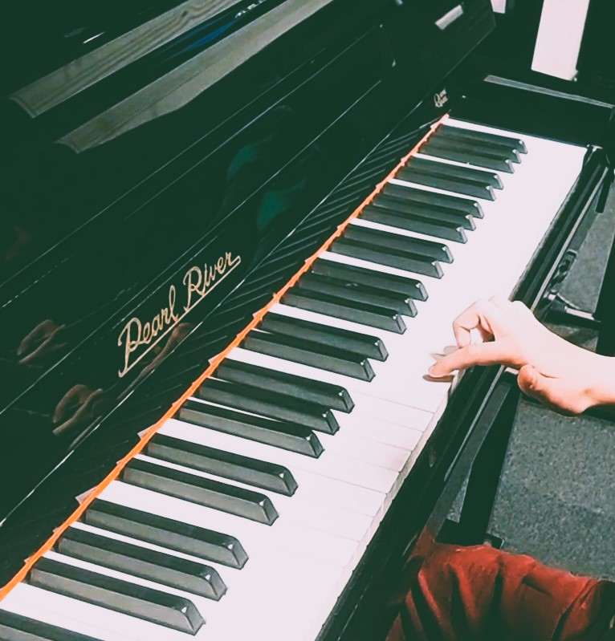

Last month, I took my sons to a music school open day, where every instrument seemed to be auditioning for a child. For a single afternoon the whole philharmonic orchestra was to be tried under one roof, and no sound was considered out of tune. The instruments were accompanied by respective teachers and these special duos were cheering, complimenting and even tricking the prospective students.

For some instruments, the teacher did not need to have any persuasive skills: in this country, there is already a strong affection for the violin, and the queues for trying it were long throughout the afternoon. Clearly, violin played the first fiddle. Thought by a teacher who resembled Miss Clavel from Madleine stories, her posture and sight were saying “strict and fair”. For some other instruments, it was the teacher’s glooming personality which likely won them potential students; definitely, it was the case of fagot. The teacher was a star: joking, dancing with the instrument, engaging kids. Oboe, that was in front of him, got only fraction of fagot’s attention, whereas sound-wise these two instruments are quite similar. Some, like double bass, tried tricks: the teacher played E-string, the thickest and lowest-sounding one. If you stood close enough you could feel the floor vibrating. The teacher asked kids to place a hand on the resonance box. If a child had high sensory sensitivity, he would be instantly won over. What all these instruments had in common, was that the teachers were necessary to help the kids produce sound. Neither blowing nor using a bow is an intuitive skill. This was in sharp contrast to piano - or rather, to the five pianos  - whose black and white keyboards were very inviting to strike a note. Even the shyest kids were eager to try.

::: {#fig1-piano}

:::

And in all this there were my two sons. AV, the older, taken there against his will. I communicated the plan for this afternoon only two weeks in advance, and he made a plan, a day before, to play with a friend. Reason, priorities and planning are not effective to persuade a nine-year-old to do something, but a little bribery is. FV, the younger, was excited. He got even more excited when he learned that he could collect a stamp for each instrument he tried. A stamp card would not work on me as motivation, but what do I know about being five—especially when a fully stamped card comes with the promise of a surprise gift?

FV immediately started his quest. First guitar, then double bass and piano. Three stamps collected. As the next one, he entered a room with a flute, a lute and a clavichord. A long line to the flute discouraged him, so he asked clavichord teacher what is a difference between the piano he had already played and “this little piano”. She was happy to explain, and he was eager to try it. No one disappointed him more than the lute teacher, who had no stamp. FV took initiative: he borrowed a marker from a different teacher in the room, and asked the lute teacher for a drawing instead. Afterwards, to my great delight, he said he wanted to try cello. And violin. The cello teacher did well, she played “Frère Jacques” bowing with his hand (and her hand on the finger board), and she managed to ignore that someone is sitting between her and the instrument. Then he patiently waited in the longest line to the violin. Not seeing much difference between violin and viola, he skipped the other long line. Even though his card was full, he kept trying wind instruments: saxophone, oboe and clarinet. In the meantime, he proudly collected his reward: a triangle-shaped marker with three colors. 

AV, on the other hand, put the card in his pocket, showing no intention of collecting any stamps. First guitar. He plucked strings with all his fingers independently, which earned him a constructive compliment from the teacher. At the double bass, he noticed the trick with touching the resonant box from the distance, so he planned to engage the teacher in a conversation that [it works the same for the cello](https://excellentproblem.com/posts/2026-03-15-tortured-neighbours-association/). The teacher acknowledged his remark but that was all - no chemistry emerged.  While on the piano, he did not really know what to do. The moment I showed him how to play first few bars of “For Elise”, magic happened. He tried to imitate. He tried to imitate for ten more minutes. Eventually I had to leave him in the room, to follow the younger one, because he was still getting the ti-da, ti-da, ti, to-di-da-dam right. Then AV found us back in the room with the clavichord, and he tried to play the melody too, on the instrument with black principal keys[^1]. The teacher sat next to him and magic happened the second time: very gently, with her left hand, she started accompanying him. He stayed with the instrument again, while me and FV left for the strings. Eventually AV collected his stamps too, but on two more occasions I needed to look for him and found him in the room with piano.

What does it teach me about my kids? Could they be more different from each other? The Younger is the more agreeable one. He likes to try the new things, and he very easily expands his catalogue of interesting activities. In addition, he can play on his own really well. He enjoys company, but does not rely on it. Also, he might easily miss a point. Or maybe it is me who is missing the point with the stamp card..? The Older is a rebellious one. He argues about every little decision I make regarding his after school time. Normally he needs a lot of attention. On the other hand, he can not eat nor drink for a day, not even pee, if he is putting together a new Lego set. Similar for an interesting book. He is not necessarily into the new things, but once tricked to try, he often finds entertainment. Usually, this entertainment is short-living and he seldom wants to repeat the activity. Nothing I didn’t know of, but it is the first time I see it as contrasting as the piano’s keys. 

Why do I even want my kids to play a musical instrument? First of all, music is fun. For everyone, there is some kind of music they are not indifferent to. Whether you deliberately listen to Bach, Jimi Hendrix or a local folk band, music brings joy. And being able to perform—or even create—it yourself is even more rewarding. Just look at how much fun improvisation can be:



More pragmatically, as a parent I want to help my kids to develop the qualities that will help them to succeed in life. Also, I am in favour of giving a fishing rod instead of the fish. I do not try to predict how the world will look like by the time they reach adulthood. Still, I will risk a prediction that humans will live in societies, and if you want to build anything that lasts, you will need to put effort. This is why I believe that focus, listening ability and persistence are currencies of the future. Learning a musical instrument is the only activity I can think of that develops all three at once, and does it in a harmonious way. On the top of that, there is a performance skill[^2]. Music builds character.

Music still stands for the proof-of-work principle: if you can play piano effortlessly, it means you have practised for thousands of hours. Playing music on an acoustic instrument is such a complex task that [it is hard—if not impossible—to shortcut](https://excellentproblem.com/posts/2026-03-15-tortured-neighbours-association/). Because of this complexity, I don’t expect there will be a pill you can take twice a day and then play piano without tedious training. Never say never: see what happened in the last decade to to the disciplined pursuit of a fit body [^3], or even to the complex and demanding skill of writing. The proof of work has collapsed for these domains, for two completely different reasons.
 
Effortless can become the goal on its own. Roger Federer, a living tennis legend, delivered a commencement speech on a rainy summer day in the intense greenery of New Hampshire. As writing and public speaking is not his domain of expertise, he hired a team of writers and speech trainers who had six months to write and refine the content, and prep him for the grand finale [^4]. The speech was centred around the three tennis lessons, that can be appreciated both by tennis adepts as well as everyone who never touched a racket. The first lesson is entitled “Effortless is a myth”[^5]:

_(...)People would say my play was effortless. Most of the time, they meant it as a compliment... But it used to frustrate me when they would say, “He barely broke a sweat!” Or “Is he even trying?”. The truth is, I had to work very hard... to make it look easy. I spent years whining... swearing… throwing my racket… before I learned to keep my cool. (...)_ 

_But then I realized: winning effortlessly is the ultimate achievement. I got that reputation because my warm-ups at the tournaments were so casual that people didn’t think I had been training hard. But I had been working hard... before the tournament, when nobody was watching. (...)_ 

_Yes, talent matters. I’m not going to stand here and tell you it doesn’t. But talent has a broad definition. Most of the time, it’s not about having a gift. It’s about having grit. In tennis, a great forehand with sick racquet head speed can be called a talent. But in tennis... like in life... discipline is also a talent. And so is patience. Trusting yourself is a talent. Embracing the process, loving the process, is a talent. Managing your life, managing yourself... these can be talents, too. Some people are born with them. Everybody has to work at them. (...)_

∗ ∗ ∗

I find it extremely difficult to write about kids. I find it even more difficult to write something about kids that might be relevant for others. All this parenting is one great improvisation I have had no training for, nor have I passed an exam for it. To drive a car you need to have a licence, to be a parent you don’t... Luckily, there are other aspects of writing about kids that might be appreciated by broader audience. And what might be better when the task is overwhelming, if not a good laugh? 

When we returned from the music school my sons shared the highlights of the afternoon with their daddy. They were tired but enthusiastic. They said which instruments they played, who they met and what they liked. My husband listened patiently, and at the end he only asked the Younger a single question: “So, FV,  do you know what would you like to play?”. “A game on tablet!”- responded FV, with no hesitation. Thank you for reading.

[^1]: One convention was, to use ebony for principal keys, and ivory or bones for the accidentals. This reverse to contemporary piano choice was an economical one, but also provided contrast that helps navigation.   
[^2]: A validated study showed that more people are afraid of public speaking than of death. [Is Public Speaking Really More Feared Than Death?](https://doi.org/10.1080/08824096.2012.667772), Communication Research Reports, Vol 29, No 2.
[^3]: [The Ozempic effect on group dining](https://www.nytimes.com/2025/05/12/dining/ozempic-group-dinner-restaurants.html?smid=nytcore-android-share), The New York Times.
[^4]: [How Roger Federer's viral commencement speech came together](https://www.nytimes.com/athletic/6414410/2025/06/10/roger-federer-viral-commencement-speech/?unlocked_article_code=1.h1A.t49i.c4BrS2MesrGz&source=athletic_user_shared_gift_article_email&smid=em-share-ta), The Athletic.
[^5]: [2024 Commencement Address by Roger Federer](https://home.dartmouth.edu/news/2024/06/2024-commencement-address-roger-federer), Dartmouth.
