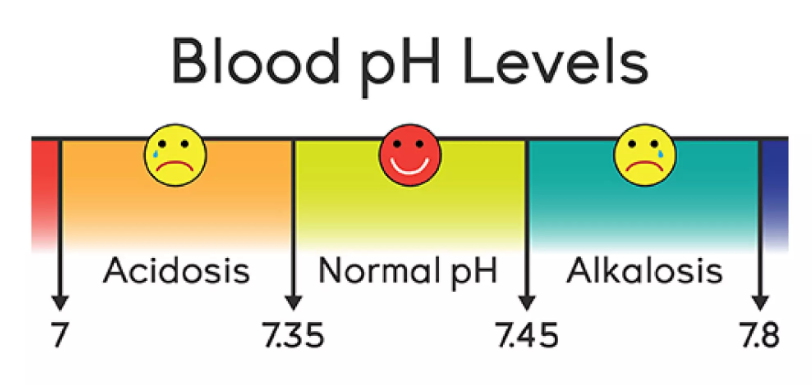

Buffer is one of the few chemical terms that made its way into everyday language. It is often used as a synonym for flexibility. I find it quite illuminating to see how far this analogy can be extended. To illustrate this, I will briefly describe the blood buffer. 

A fun fact about blood is that it is classified as a tissue[^1]. And what makes blood unique as a tissue is not only that it is liquidous, but also that it is the only tissue that penetrates all other tissues. This reach is dictated by its function: delivering oxygen and removing carbon dioxide, as well as supporting immunological response and wound healing. Blood has to be like a fire brigade – it has to reach everywhere. In practice, just an existence of marvellous infrastructure of roads (aka blood vessels) would not be enough to access any cell in the organism, if the road conditions weren’t permissive. If it was too slippery or if the asphalt was melting. This is where the role of the blood buffer comes in.

In contrast to a fire brigade vehicle, which a skilled driver can operate under wide range of weather conditions, processes in living organisms can be carried out within a narrow window of acidity conditions[^2]. Acidity can be measured and has its own scale. It is called the pH scale, going from 0 (acidic), through 7 (neutral) to 14 (basic). The role of blood buffer is to ensure that blood’s pH is stable, in the narrow range 7.35-7.45[^3]. 

::: {#fig1-blood-ph}

If you wonder what happens beyond 7 - 7.8: the grim reaper happens. [Source](https://www.slideshare.net/slideshow/blood-ph-balance/256651852#1)
:::

Wait Aleksandra, you might say –you’ve been arguing that a buffer is about flexibility, and now you claim that it does the opposite, like stabilization?! I admit, it sounds contradictory, but that is how it works: a buffer provides flexibility to ensure stability. 

By taking up excess acidic or basic ions in the blood, a buffer keeps pH stable. And this is exactly what we expect from flexibility, isn’t it? We want to absorb an unexpected costs of a broken washing machine without going into debt, we want flexible working hours to fit a dentist’s appointment without taking half a day off. We don’t want this off-events to disturb our lives equilibrium. In a similar way, the functioning of a living organism cannot be perturbed by changes in concentration of acids or bases. And same as off-events just happen, changes in acidic and basic ions are simply a reality for metabolically active cells.

Flexibility is therefore the ability to accommodate unfavourable outcomes. These outcomes might result from bad luck - like a broken washing machine; or from suboptimal decisions – such as planning a dentist’s appointment during your working hours. Flexibility is what we need when reality refuses to follow the optimistic script we had in mind. And we write these wishful scripts all the time: “we are going to barbecue this weekend” (because we assume there will be no rain), “I hold a stock in company X” (because I assume its share price will grow), “I am training to become a baker” (because I assume there will be a market for bakers in the years to come). 

In “The Intelligent Investor”,  a founding book for value investors, its author Benjamin Graham coined the term “margin of safety”[^4]. The margin of safety remains relevant today, even though the last revision of the book dates back to the seventies. An essence of its utility was provided by Graham in just a few words: “margin of safety is to make all prognoses redundant”[^5].

Financial flexibility is likely a dominant example people have in mind when they talk about flexibility; perhaps it is on par with time flexibility. I would like to argue that there are other aspects of life for which this concept is just as valid. For that, I have a little story.

We promised to our son to go to the swimming pool on a weekend. 

There is a swimming pool in our neighbourhood that is perfect for the occasion: open on Sundays till noon and, besides the main pool, it has two small pools for kids. The layout is open, all visitors are within sight. The day we decided to fulfill the promise was perfect for a pool visit: almost 30^o^C, no clouds in sight. When we arrived, to our great surprise, the doors were shut. It turned out that the pool was closed that day, which was announced on its website. However, we hadn’t checked the website before leaving from home, we did so only at the gate. It was too late: our betrayed 5-year-old was gearing up for his performance and we knew that the window to react - to save the day – was closing. Yet all pools but one appeared to be closed on that particular day. The only one open was a sort of swimming complex, with slides, water massages and saunas. It is 30min ride from our home, the tickets are four times more expensive and given the effort it only makes sense to spend at least half a day there. We were not in a position to make an optimal decision, though. FV was already crying that he wanted to go the swimming pool and that we had promised. Luckily, on that day, we were able to say yes to the swimming complex. 

We were able to do so, because we had all the required buffers at our disposal. We had the time to travel farther from home and to spend longer at the pool than initially planned; we had the funds to pay for the tickets and the lunch out (time for swimming = no time for cooking); we were two parents for three children, providing the attention buffer that you need in a big resort with kids; and we had expectation buffer: namely, the only expectation was to fulfil the promise made to FV and take him to the pool – none of us was aiming to swim a few lengths or so. Important to mention, none of these buffers would have been needed to visit the neighbourhood pool.

What stayed with me afterwards were two things. First, even such a banal perturbation as a closed local swimming pool could be absorbed only if several different buffers were available at once. If one of them was missing, the others could not compensate for it. Second, things become quite interesting when you start seeing everyday disruptions as perturbations of equilibrium[^6]. Once I began doing so, the natural question was:

What kind of flexibility am I lacking and would like to build? 

Honestly, there was not much competition for the first price, the answer came to my mind immediately. The clear winner is patience. 

And not the “I am doing something, I want to have outcome quickly” patience. This kind of patience I already have – after years at the bench and a PhD in biochemistry, I am trained to withstand failures that might last for years. The patience that I miss is the “my toddler is sitting in a puddle, crying, and won’t let me pick her up” kind of patience. I am craving a buffer not to overreact.

A dear friend of mine tattooed a shell on herself. On that occasion, I learned from her why you hear the see in a shell. The soft whooshing sound you hear when you hold a shell to your ear is in fact the sound of blood circulating in your vessels, amplified by the shell. Same as concert halls are built to  amplify sounds made by musicians on stage! She tattooed the shell as a reminder that the calmness she is looking for is already within her. Beautiful, isn’t it?

::: {#fig2-shell}

:::

You see - blood again. I do not have a shell tattoo as she does; also, she is much better with poetic figures than I am. But I realised that what I can do as a reminder to myself is to take a deep breath. Let the blood take up oxygen from the air and release carbon dioxide. And remind myself that this exchange is possible only because I have a functioning pH buffer in my blood. I already have a tool within me to absorb the sourness of everyday life.

Maybe I should tattoo a bicarbonate buffer equation..? Thank you for reading.

[^1]: It is so, because blood is a collection of similar cells performing orchestrated functions. A fact that it is liquidous does not contradict this definition, to my great surprise.

[^2]: And the more complex the organism, the less accommodative it is. Let’s be proud of ourselves, we, the crowns of creation.

[^3]: Here is a cool website that allows you to check acidity of common fluids and translates it to the required number of acidic ions in solution: [ACS](https://www.acs.org/education/resources/undergraduate/chemistryincontext/interactives/water-everywhere/ph-scale.html)

[^4]: It has to do with the difference between the price for which you buy company share and its true intrinsic value. The bigger the difference, the bigger cushion you have. 

[^5]: This particular wording of Graham appears in Morgan’s Housel “Psychology of Money”

[^6]: Just don’t go too far. Everything looks like a nail...
