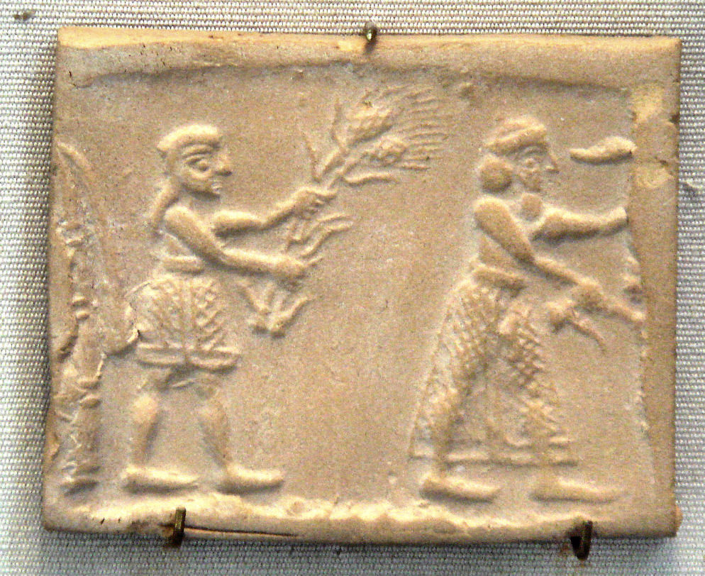

There is a certain perverse pleasure in being proven wrong. I felt it while listening to a podcast episode on the Neolithic Revolution[^1]. To set the stage: the Neolithic Revolution, also known as Agrarian Revolution, was the transition from nomadic to sedentary way of living. It happened ~eleven centuries ago and was foundational for setting the direction the _Homo sapiens_ development took further on. Among the things that the Agrarian Revolution made possible are: permanent settlements - cities and taxation, specialization - studying sciences and building armies, new diseases - tooth decay and zoonotic ailments, to name just a few. 

I have been fascinated by the topic ever since I first heard about it; I went on to read the thematic popular science books eagerly[^2]. Each book presented the transition from a slightly different angle, yet they were all consistent about a special role of the domestication of wheat, almost “the spark of the revolution”. Why was that? Wheat was a grass native to the fertile crescent between Tigris and Euphrates and it was there that people could start growing it deliberately. Because the soil in that region was productive, they could obtain a decent yield of grain from a relatively small area. As a result, they no longer needed to move as much to secure food, and could abandon the nomadic lifestyle. 

Even though the immediate “less work to obtain your food” gain[^3], was only an apparent gain, the lifestyle change introduced a degree of stability, a chance to put down roots. If the purpose of your daily life was to secure food, such change might well have been worth considering, wasn’t it?

However, none of my readings provided a convincing explanation of why wheat, in the first place, became such an influential plant. Why choose a plant that produces no sweet fruit? One that requires so much processing?[^4] One that is laborious to handle – both demanding and non-intuitive?

::: {#fig1-summer-wheat}

Sumerian cylinder seal impression dating to c. 3200 BC. [Source:](https://en.wikipedia.org/wiki/Wheat#/media/File:UrukPlate3000BCE.jpg)  
:::

Imagine preparing land to be able to grow something that cannot be eaten as is, requires multiple non-intuitive processing steps with specialized tools and at all the effort yields a tasteless powder. That is not the kind of work humans usually opt for, at least not the humans that I know. We get a kick from sweet and salty, and a warning from sour and bitter. But wheat gives no immediate signal.

The point for wheat is that you can store it. How far you can get if you store a thing of value, you see later in history with money. As wheat precedes money in time, it might have been the first time people could start thinking long-term, beyond the current season [^5]. And even though wheat does not arouse our taste buds, it sends another signal: signal of fullness (albeit belated). Another “for” argument is that sedentary women could have kids more often. There is a fascinating study from __XXX researchers__ that compares mineralized tissue patterns in teeth of nomadic vs sedentary women[^6]. 

Penzić and colleagues elegantly combined two facts: first, that from the beginning of time, pregnancy has been a woman’s greatest metabolic stressor; and second, that periodic patterns in tooth cementum - read in a way similar to tree rings - are perturbed in the presence of major stress. As a consequence, they developed an approach to determine how many times a female was pregnant. Having teeth from both nomadic and sedentary women at their disposal, they showed that, on average, sedentary women were pregnant more frequently than their nomadic peers.

Although I find the study captivating, I struggle to weight the fertility argument against the emergence of zoonotic diseases. If over the course of a lifetime a person might experienced a few epidemics that decimated the population, does it really matter there were more children per woman?[^7] 

If by now you feel confused by the argument laid above: welcome to the club. It is far from conclusive, perhaps not even logical. For a long time, I treated the special role of wheat as one of these “whys” that I enjoyed to think about without feeling any pressure to resolve. An excellent problem. I knew that there are people in this world who have the answers, yet I could sleep perfectly well without knowing their works. 

That changed when I came across episode 282 of Scientific Radio, a podcast that started with a striking claim: “revolution” is not a good name for the famous neolithic transition. I am all ears when it comes to [precise scientific terminology](https://excellentproblem.com/posts/2026-05-01-survival-of-the-diversified/), and what followed had helped me to piece the almost 20 year old puzzles together. 

Namely, in the common usage we associate revolution with something sudden and game changing. The French Revolution and the Bolshevik Revolution are good examples thereof. We also apply the term in technological context - the Industrial Revolution, the Scientific Revolution, the Digital Revolution – the transformative events but not comparable in velocity to the famous political upheavals. Among revolutions, an interesting case of political change is the Velvet Revolution. The adjective “velvet”, almost an oxymoron in this context, highlights the non-violent separation between Czechs and Slovaks in 1989. 

The point is, the transition from nomadic to sedentary lifestyle, the so called Agrarian Revolution took a thousand, maybe two thousands, years. That’s all about swiftness of the process.

In fact, the whole transition was an example of natural preservation operating at the level of human groups. Nature has time on its side. Some people practiced nomadic lifestyle, others a sedentary one; let them. The two groups did not need to compete for the same territory immediately, because nomads tended to dominate were soils were poor and unproductive. 

Later on, when humans started breeding animals a new player entered the game: diseases. You breed pigs, you might contract their diseases. Many individuals died from them, but some survived and built immunity. That immunity was their super-power when encountered nomads who were, for the first time, exposed to zoonotic diseases[^8]. Eventually, more pregnancies resulted in more kids per woman, and that effect compounded over time. Over millennia, to be more precise. When you start to think about the apparent revolution as a long, gradual and accumulative process, it all begins to make sense.

It then also made sense to me that people at that time did not deliberately choose between one lifestyle and the other. They were likely passive opportunists, adopting whatever strategy was easier to implement in the region where they lived; defaulting to the path of least resistance. As Yuval Noah Harari puts it in _Sapiens_, “Wheat domesticated _Homo sapiens_ rather than the other way around.”

In my thinking, I made a mistake of judging the past by today’s standards. The contemporary human being - undersigned below included - may consider an hour spend preparing food as an eternity. For nomads, it was nothing of the sort. Food gathering and processing were the main themes of their lives; they knew no other way of living. 

My last sin was failing to appreciate the power of time. It is funny, because I had no difficulty seeing that, after gazillion years, bacteria could transform into intelligent apes, a perspective I have explored on this blog on multiple occasions. Yet, I unconsciously expected that the agrarian transition to happened quickly, as if the decisions were made deliberately and swiftly. Likely because humans were involved.

The benefit of being proven wrong is that afterwards you are a little less wrong. And being a tiny bit closer to the truth is something, isn’t it? Thank you for reading.

[^1]: One of the great benefits of knowing polish is to be able to listen to [this podcast](https://radionaukowe.pl/podcast/prapolska-jak-pierwsi-rolnicy-wyparli-lowcow-zbieraczy-prof-iwona-sobkowiak-tabaka/)
[^2]: A book that made great impression on me was “Na początku był głód” by Marek Konarzewski.
[^3]: Scientist are quite agreed upon that a nomad was "working" fewer hours a day to get their food, much less than early farmers had to.
[^4]: Next to harvesting, requires peeling and milling, mixing with water/eggs, and still does not taste even remotely as good as berries do?
[^5]: Given that we practice any form of sedentary lifestyle only for ~eleven centuries, is a valid argument why, on average, we are such bad long-term planners.
[^6]: 2020 paper from Balkans
[^7]: Also, a direct casual link between more pregnancies and more children is not so straightforward. Without data on newborn mortality (which I assume it was higher among sedentary women) it is impossible to say how more pregnancies contributed to population growth.
[^8]: Millennia later, the same effect took its tool when Europeans “discovered” America and their germs were as effective at decimating the native population as their guns were - more on this in _Guns, Germs, and Steel_ by Jared Diamond
