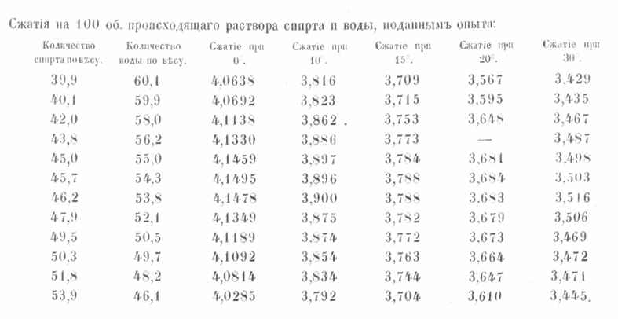

Long before he became the patron saint of the periodic table, Dmitri Mendeleev was allegedly assigned a problem of more immediate public importance: vodka was disappearing from a St Petersburg distillery. The principals noticed that the amounts of water and spirit - two plain substrates used in the process - were greater than the amount of vodka produced. Instead of taking the path of least effort and accusing the workers of stealing, they demonstrated a growth mindset and called in a promising chemist to investigate.

Mendeleev mixed water and ethanol in different ratios and reproduced, on a small scale, the same thing the distillery had seen at industrial scale: the volume shrunk! He named the phenomenon cжатiе, szhatie, which translates into English squeezing, contraction. Do you remember the school stones-and-sand explanation of contraction? Small grains of sand can slip into the spaces between bigger pebbles. A modern chemistry interpretation relies not only on simple geometrical packing, but also on interactions between water and ethanol molecules. We know that at the molecular level, water and ethanol form hydrogen bonds with each other. The resulting network of bonds brings the molecules closer, and all together it demonstrates in shrinking volume of the mixture.

::: {#fig1-table-p88}


A table from Mendeleev's thesis, showing contraction of water-ethanol mixture at different temperatures.
:::

It is difficult to say how much truth there is in the distillery story – I am mostly amplifying something I once heard in a lecture. The fact is that the chemist whose name we so uniformly associate with the periodic table defended a doctoral thesis entitled “Dissertation on the Combination of Ethyl Alcohol with Water”, at the Imperial Saint Petersburg University. He spent his entire adult life in the city. The first written record of contraction is traced back to this thesis. Furthermore, contraction seems more than relevant to any distillery. The phenomenon is significant enough to be seen with a naked eye. And volume, compared with weight, is easier to use when dealing with fluids. Think of all these recipes that ask for a glass of oil or two glasses of milk. Likely, if at the distillery they had weighed the water and ethanol used, and then the produced vodka, they would have seen that the mass had not changed. Or maybe they did? That would actually explain why they brought in a researcher: mass stays the same, volume shrinks - what the hell is going on?

My great revelation on the topic was that the Mendeleev’s thesis is now attached to [his Wikipedia!](https://upload.wikimedia.org/wikipedia/commons/3/3f/%D0%9C%D0%B5%D0%BD%D0%B4%D0%B5%D0%BB%D0%B5%D0%B5%D0%B2_%D0%94.%D0%98._%D0%A0%D0%B0%D1%81%D1%81%D1%83%D0%B6%D0%B4%D0%B5%D0%BD%D0%B8%D0%B5_%D0%BE_%D1%81%D0%BE%D0%B5%D0%B4%D0%B8%D0%BD%D0%B5%D0%BD%D0%B8%D0%B8_%D1%81%D0%BF%D0%B8%D1%80%D1%82%D0%B0_%D1%81_%D0%B2%D0%BE%D0%B4%D0%BE%D0%B9._(1865).pdf) Since I cannot read Cyrillic, I scanned the document for plots but did not find any. A picture says more than a thousand words, but apparently not in 1865. At that time, the peak of visualization was a neat table with numbers. With the help of Claude, I arrived at page 88, which displays a table with data on the contraction of water-ethanol mixtures at different temperatures. I decided to put some life into this data and represented it in the diagram below:

```{r}
#| echo: false
#| warning: false

source("../../assets/inferno_palette.R")
library(plotly)

ethanol <- c(39.9, 40.1, 42.0, 43.8, 45.0, 45.7, 46.2, 47.9, 49.5, 50.3, 51.8, 53.9)

c0  <- c(4.06, 4.07, 4.11, 4.13, 4.15, 4.15, 4.15, 4.13, 4.12, 4.11, 4.08, 4.03)
c10 <- c(3.82, 3.82, 3.86, 3.89, 3.90, 3.90, 3.90, 3.88, 3.87, 3.85, 3.83, 3.79)
c15 <- c(3.71, 3.72, 3.75, 3.77, 3.78, 3.79, 3.79, 3.78, 3.77, 3.76, 3.74, 3.70)
c20 <- c(3.57, 3.60, 3.65, NA,   3.68, 3.68, 3.68, 3.68, 3.67, 3.66, 3.65, 3.61)
c30 <- c(3.43, 3.44, 3.47, 3.49, 3.50, 3.50, 3.52, 3.51, 3.47, 3.47, 3.47, 3.45)

colors <- INFERNO$palette

plot_ly() %>%
  add_trace(x = ethanol, y = c0,  type = 'scatter', mode = 'lines+markers',
            name = '0°C',  line = list(color = colors[3],  width = 1, dash = 'dash'),
            marker = list(color = colors[3],  size = 12)) %>%
  add_trace(x = ethanol, y = c10, type = 'scatter', mode = 'lines+markers',
            name = '10°C', line = list(color = colors[5],  width = 1, dash = 'dash'),
            marker = list(color = colors[5],  size = 12)) %>%
  add_trace(x = ethanol, y = c15, type = 'scatter', mode = 'lines+markers',
            name = '15°C', line = list(color = colors[7],  width = 1, dash = 'dash'),
            marker = list(color = colors[7],  size = 12)) %>%
  add_trace(x = ethanol, y = c20, type = 'scatter', mode = 'lines+markers',
            name = '20°C', line = list(color = colors[9],  width = 1, dash = 'dash'),
            marker = list(color = colors[9],  size = 12),
            connectgaps = FALSE) %>%
  add_trace(x = ethanol, y = c30, type = 'scatter', mode = 'lines+markers',
            name = '30°C', line = list(color = colors[11], width = 1, dash = 'dash'),
            marker = list(color = colors[11], size = 12)) %>%
  layout(
    xaxis = list(title = "Anhydrous ethanol, parts by mass", showgrid = FALSE),
    yaxis = list(title = "Contraction", showgrid = TRUE,
                 gridcolor = "rgba(0,0,0,0.08)"
                ),
    plot_bgcolor = 'white',
    paper_bgcolor = 'white',
    legend = list(orientation = 'h', x = 0.5, xanchor = 'center', y = -0.2)
  )
```

Mendeleev’s data are shown in cold blue at 0^o^C and bright yellow at 30^o^C. Yes, he was able to measure water-ethanol mixtures at 0^o^C, because these solutions freeze at -20^o^C and below. You can see that, at each temperature, contraction reaches its maximum at the same alcohol to water mass ratio, ~45.7:54.3. However, I must not shy away from the fact that what grabs my attention most is not the maximum on the plot, but the broken 20^o^C curve. And now the modest plot starts doing more than showing data: it leads me to two unexpected reflections.

This is the first time in this blog that I present a function at different temperatures, and I find it oddly fulfilling. I find it fulfilling because the color palette I use across the blog is called inferno. You know, like “hell”. And what in hell could have inspired such colors? Temperature gradient  - flames. I could easily write a post on the utility, readability and overall superiority of the inferno palette – and maybe one day I will. The point is that the temperature gradient in Mendeleev’s data lines up with the color gradient of flames. High five, Dmitri!

And the broken curve makes the data feel more real. What happened? Did he lose the sample? Damaged it? Was he too lazy to repeat the measurement? Too sloppy? Too tired? Under time pressure? Would this missing data point have disturbed him more if he had seen it on a plot, rather than as a missing value in a table? Suddenly, Mendeleev becomes less patron saint and more human. Even a dry table can betray the imperfect hand that sketched it — especially when that hand would later sketch the Table.

So think warmly of the bearded Russian when fighting the luggage of brutally limited volume. Socks can fit in between. Thank you for reading.
