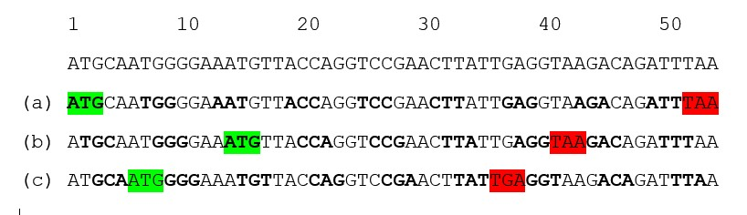

If you trained in one discipline and then started a career in another, you have probably been asked endlessly: “Was it worth studying X?” or “Do you use anything you learned in X in your work in Y?”

The less the two fields seem to overlap, the more often the questions arise. I studied (bio)chemistry until I was 30, and moved to IT shortly afterwards. I got these questions in virtually every job interview, at every reunion with classmates, and every bit of small talk with a colleague who had just discovered my background. And that’s no exaggeration.

The thing is, while I understand the interest behind these questions, I think there is a  better way to frame it — for example:

__“What are the coolest ideas from the natural sciences that could apply in IT?”__

That is a great thing about having a blog: I can ask myself, and even answer, any question I want[^1]! So now I am going to take full advantage of that privilege and answer the better question.

First of all IT is a young field, and its vocabulary borrows heavily from older, more established disciplines. Starting from trivial head-body-tail division of the code, through neural networks used in machine learning, to distillation in LLM training, IT is deeply indebted to the natural sciences. That leads to my first lesson: my background enables me to understand the analogies embedded in this vocabulary, gauge how far they hold and ask curious questions. This familiar language gives me a kind of intellectual scaffolding. I might not know the building – how a particular technology works from the inside – but I recognize the structure around it. The analogies give me footholds from which I can explore the new and gradually find my way in. 

One of the most important frameworks that helps me think in general is the theory of evolution ([here](https://excellentproblem.com/posts/2026-01-15-caveman-baby/), [here](https://excellentproblem.com/posts/2026-05-01-survival-of-the-diversified/), and [here](https://excellentproblem.com/posts/2026-08-02-domesticated-by-wheat/)). It offers a wealth of concepts applicable far beyond biology. So it came to me as no surprise that the theory suits IT too [^2]. What did surprise me though, was that IT had produced a tool that resembles an upgraded evolution. The idea behind the tool is version control, and the tool is named Git.

Imagine you can trace information back to its source, see how it changed over time and identify who made each change. And information can be understood very broadly:

-	__deleted material:__ read errased chapters of Harry Potter - they did not fit the main story, but might still work as standalone stories;

-	__political views:__ trace world view of any politician, see how it was changing, and then overlap it with the election cycle;

-	__gossip:__ discover who started it and how its content changed as it spread;
-	__canonical texts:__ trace who authored the Bible, how its canon was established, and how it changed over time;

-	__language:__ follow changes across time, subcultures and communities, and locate the earliest recorded uses of particular words;

-	__status of shared spaces:__ who left mess in the kitchen?

::: {#fig1-bible}

Gutenberg Bible in the Beinecke Rare Book & Manuscript Library at Yale University in New Haven. [Source](https://en.wikipedia.org/wiki/Gutenberg_Bible#/media/File:Gutenberg_Bible_at_Yale.jpg) 
:::

Normally, this kind of information is not available. Dedicated journalists and researchers can sometimes shed light on a limited number of such topics, however, none of them will help me to determine who left a mess in the kitchen. Only the researcher in me.

Software is different: every change to every line of code is recorded and every change has an author. This is possible thanks to a system called version control, of which the most adopted implementation is Git[^3]. Interestingly, provenance and ownership are somehow [side effects](https://excellentproblem.com/posts/2026-05-31-relying-on-side-effects/) of Git. Its primary goal is to enable collaborative work on code. You can think of software development as multiple people working on a single text at the same time – it is a highly parallel process. If you ever tried that (with the text), you know how painful it can be. For software, Git makes such collaboration not only possible but also fast and scalable. As remarkable as Git is, I claim that it stands on the shoulders of a giant called evolution – though it introduces some remarkable upgrades.

To begin with the common ground, in both cases we talk about code: version control manages computer code, whereas evolution acts on genetic code. Computer code is binary, using 0 and 1, whereas genetic information is encoded using four nucleotides: A, C, T and G; in both cases the set of symbols is finite and discrete. To see where this analogy leads, let’s consider the human genome.

In April 2003, the Human Genome Project was declared complete, producing the first sequence of the human genome [^4]. The timing was no coincidence: it marked the 50th anniversary of the discovery of DNA structure. Time was spent, money too, politicians were invited and ready to make grand announcements. Yet alongside the bold declaration by leaders of six contributing countries, on sequencing “the molecular instruction book of human life” [^5], came a more difficult message. Namely, science at the time had little idea what the vast majority – around 98% - of the code was for[^6]. Only 2% of the genetic code encoded protein sequences and was therefore called the “coding DNA”. Much of the remainder, way more than 90%, was labeled as “junk DNA”. What a humble naming convention -  “we don’t know what it is so let’s call it junk” [^7]. For some chromosomes, the “junk code” was not only cryptic, but also highly repetitive.

I would argue that the name “junk code” and significant code redundancy are relevant to computer code too. Heartwarmingly, back at the outset of the twenty-first century, some scientists made an intellectual effort and proposed that the non-coding DNA might be a reservoir for new genes. Nowadays, junk computer code serves as a reservoir for new executable code written by LLMs. 

If you want to start working on computer code, you need to clone the repository. Yes, this is the git command, “git clone” [^8]. Cloning makes a local copy of the existing code that a developer can then edit and expand. Working on a copy is a neat principle that nature has practiced for eons: DNA replication is written into the very structure of the iconic double helix, as the two strands are complementary. 

Funnily enough, one of the sources of changes in biological code is error. If an enzyme responsible for creating a copy of the unwound DNA makes an error – for example, introduces C instead of G, introduces two Gs or even skips G entirely - the genetic code changes. Such a change can occur at any position in the genetic code: it is random. In contrast, developers make changes at specific positions and the piece of code they introduce is not random but intentional.

Just before introducing a change to the code, developers branch off from the main codebase  - the git’s consensus code. By doing so, they create a pointer marking where the code begins to deviate. As multiple developers can collaborate on the same code, the consensus code and the development branches form a tree. A Git tree. Evolutionary relationships between species are, surprise, surprise, also represented as a tree. The tree of life. Here comes a sharp differentiator: work on computer code, in contrast to evolution, is directed, intentional and purposeful. Therefore, it requires an operation that introduces the changes to the consensus code - to the trunk of the tree. This operation is git merge. In nature, there is no life merge[^9]. Branches of the tree of life do not return to the stem, which makes it resemble a real tree more closely. A git tree, by contrast, is more like a messy braid.

::: {#fig2-tree}

Not the tree of life, but definitely a living tree.
:::

As git merge makes intentional code development possible, there is even an option to block a change if it is considered undesirable. This power comes with code review: a second pair of eyes critically evaluates the altered code. In the context of genetic code, the reviewer’s position is a perfect vacancy for a god-like entity. If a protein with a similar function is ever discovered in some obscure bacterium, it should be called Almighty. 

Merge and review grant developers superpowers compared with biological evolution. If nature had such tools, would it create more successful organisms? Would tidy, efficient code with no redundancy define a superior creature? And what if I tell you that organisms with tidy and efficient genomes, with no redundancy already exist? Ladies and gentlemen, welcome to the microbiology class of September 2026!

Both bacteria and viruses have genomes that are relatively short, not very repetitive and extremely efficient at coding proteins. I would even argue that microbial genomes are often even more efficient at coding than any computer code is. Here is how.

The genetic code is triplet-based. It means that three nucleotides - a combination of A, C, T and G - code a single amino acid/stop signal. Three to one. For example, ATG codes M (methionine; also called a start codon), GCC codes A (alanine), and TAA is a stop codon. This means that in a DNA strand there are three positions at which sequence that codes protein might start:

::: {#fig3-orf}

One DNA sequence, three possible ways to read it. Start and stop codons are highlighted in green and red. They delineate peptides that would be produced if reading frame started from (a) 1st, (b) 2nd or (c) 3rd letter of the code. 
:::

And there are microbes that exploit multiple reading frames at once, for example [Sars-CoV-2](https://doi.org/10.1016/j.virol.2021.02.013). Do you see the ingenuity of this solution? I will now try to translate it to the software design:  

This python code is compact and tidy:

```python
with open("data.txt", "r") as f:
	content = f.read()

print(content)
```
It is efficient at doing three things, in consecutive order:
```python
open_file()
read_file_content()
print_the_content()
```
changing the reading frame by 1 will result in code: 
```python
ith open("data.txt", "r") as f:
	content = f.read()

print(content)
```
imagine that the code above is functional and it does:
```python
check_the_date()
	if date_is_1st_of_the_month: 
		handle_security_updates()
		restart_computer()
	else:
		complete_the_check()
```
So to answer the question I started this post with: the coolest idea from the natural sciences that could be explored in IT is code with multiple reading frames. Is it possible? I do not know. Do we have a programming language that makes it possible? I do not think so, but we have immense inspiration from nature. Is it even worth pondering about? Absolutely!

The ideas also migrate in both directions: I think there is a great market for information provenance and ownership. Personally, I would be most interested in seeing version control of the Bible. And of my kitchen, of course. But I am afraid that both might be beyond reach - not so much because they belong to the past, but because the idea would face backlash from its opponents. Still, there are many fields that could benefit from version control almost immediately.

To close, let’s change the reading frame of the python code once more, and see what it might do:

```python
turn_off_my_phone()
dim_the_light()
play_suite_VI()
```
IT has still plenty to learn from biology, because biology is the very first IT. Thank you for reading.



[^1]: This way I will have a written reference I can send someone to, whenever I get this question again. I will have a QR code to this post in my wallet, I swear. 

[^2]: Yes, I know the proverb “If you have a hammer everything looks like a nail”.

[^3]: It is not the purpose of this post to distinct Git from other version control systems that exist. It is more about version control as a conceptual framework that enables collaboration and tracing information provenance, using Git and some of its vocabulary to build analogies.

[^4]: In 2003 just the genome's euchromatic part, comprising 92% of the code, was sequenced. It took twenty more years to sequence the remaining 8% of the more structurally challenging code.

[^5]: More context for the HGP you can find [here](https://plato.stanford.edu/archives/fall2018/entries/human-genome/).

[^6]: Naturally, this message did not fit the official announcement.

[^7]: Since then substantial progress has been made and now we know that massive parts of DNA that are not coding any proteins play crucial regulatory roles. They enable to modulate when, where and how much of a protein to express. What is even more mind-blowing is that differences between species, even as gorgeous as Homo sapiens and chimpanzee, are mostly in the regulatory sequences, not in “executable” sequences that code proteins. 

[^8]: Is there any other discipline to which cloning belongs more than to biology???

[^9]: I am not entirely correct here, because two organelles profound for energy processing were acquired by an eucaryotic cell (=cell with a nucleus) because of a sort of merge. I am talking about mitochondria and chloroplasts, which were incorporated into the cell by in the process called endosymbiosis. Still the process is rather an exception confirming a rule that in biology everything is possible, rather than typical mechanism. In contrast, computer code would not exist without an option to merge a new code. 

