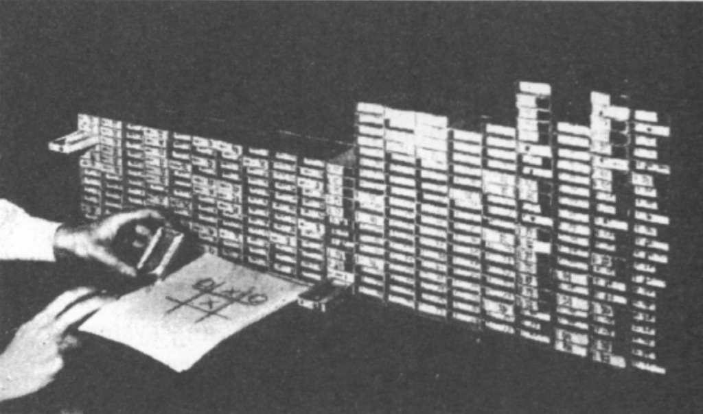

---
title: "Introduction to MENACE"
author: "Aleksandra"
date: "2026-09-30"
categories: [AI, interactive, symmetry]
description: "The hardest part is to understand fundamentals."
image: "thumb.png"
title-block-banner: true
---
Donald Michie received a scholarship to study classics at the University of Oxford. Normally, it would have been a great opportunity for a 20-year-old, but the timing was against him: these were early 1940s and World War II was raging. Instead of studying classics, Donald decided to follow his father’s advice and do “something unspecified but romantic” to aid the war effort. His chose to sign up for a Japanese-language course at the Government Code and Cypher School in Bedford. However, upon arrival, he was informed that the class was full. What was still available was training in cryptography, in which Michie - specifically and romantically - enrolled[^1]. 

Soon he was recruited to Bletchley Park, the secret code breaking center. Michie was assigned to the "Testery", a section working to break the German cipher internally called Tunny. It was at Bletchley Park that he met and befriended Alan Turing[^2]. What bonded them was their shared inability to play chess, and their willingness to play it anyway. In Michie’s own words:[^3]

> _[with Alan] We didn't work in the same section. It came about because in Bletchley Park, everybody was either a chess master or they didn't play the game at all, with two exceptions. And Alan Turing and I were the only two people in Bletchley Park who were bad enough to give each other a level game. And nobody else would play with us, of course. So we got into the habit of having a weekly evening in a pub in Wolverton, near where he had digs. And we played chess, but we also talked about other things, which in those days we called thinking machines._

This post introduces a thinking machine, or rather a machine capable of learning, the one Michie built in early 1960s. Built out of absolute scarcity and absolute ingenuity.  With no budget whatsoever. Built to win a bet. But we will get there soon.

Bletchley Park’s codebreakers were credited by Churchill with shortening the war by years. Yet in post-war Britain, the computers were beyond the codebreakers’ reach. And even if they had been available, the consensus was that computers were useful for calculations, and little else. Michie was interested in computing, but not in cracking numbers - he had been bred on cracking codes. It comes as no surprise to me that he chose as close as possible, to work on the uncracked-then code: the genetic [code](https://excellentproblem.com/posts/2026-09-13-biology-is-it/). He eventually earned a PhD in genetics. During his doctoral studies, Michie stayed in touch with Turing, still fantasizing about a chess playing machine. Their paths crossed again in Cambridge, in 1948:

> _I should have mentioned that Turing and Champernowne, and I found in Cambridge, had devised a chess machine. Of course, there was no machine in the usual sense. We would call it a program [Turochamp]. And the individuals themselves had to pour through the sheets and sheets of paper, look up tables, and so forth, and make the moves for the machine. And Shaun Wylie, also Cambridge, who was a wartime, literally, colleague of mine, I decided, well, they better have a challenger. So that gave rise to the Machiavelli, [another set of instructions written on paper] for Michie-Wylie. And the idea was to play these two paper machines off against each other, which Turing attempted to do on the Manchester Baby, the very first stored program electronic machine. But Tom Kilburn didn't think that was a very good use of scarce time, and somehow the project never got finished._

The drought of funding for non-numerical computing lasted for almost two more decades. Since Michie “had to do something”, he took up a position in the Department of Surgical Science at the University of Edinburgh, where he worked on reducing the graft rejection in human patients. So that was the environment in which the ideas about intelligent machines continued to brew. One day, challenged by a medical colleague, Michie put these ideas into practice by building an ingenious mechanical learning machine, later known as MENACE:

> _(...) And in the staff club bar one day, Hugh Begbie, one of my medical colleagues, insisted that it was intrinsically impossible for a machine to learn. (...) So anyway, rather than argue, I thought, well, let's see if we can do something about it. And having time to spare in the evenings and an indefinite supply of Swan Vestas, the nice big ones, Swan Vestas match boxes, I was able to assemble a, which I think is possibly the first trial and error learning machine._

MENACE stands for Matchbox Educable Noughts and Crosses Engine. It is a set of matchboxes filled with colored beads. After playing a few hundred games against a human, it learned to play noughts and crosses:

> _But by about, I think, something like 500 successive plays against me, which gruelling work for at least one of us, it was move perfect. So I claimed my money._

How on earth can a set of matchboxes learn anything?

::: {#fig-menace-engine .figure-highlight}


MENACE engine and the hands of its human operator. Picture from the 1963 Michie's paper, reprinted [here](https://opendatascience.com/wp-content/uploads/2018/05/Screen-Shot-2018-05-22-at-3.50.51-PM.png).
:::

You know noughts and crosses, the two-player game played on 3x3 board. MENACE is Player 1, so it has the privilege of making the opening move. Because that move is made on an empty board, only one matchbox is needed to represent this board position. The box has 24 beads: eight beads in three different colors. Its human operator[^4] mindlessly draws a bead, and its color dictates where MENACE places its nought. The operator repeats this procedure for every MENACE move, drawing beads from the correct matchboxes. Once the game is over, he also updates the number of beads in the matchboxes used, based on the outcome. If MENACE wins, the operator adds three more beads of the same color to each matchbox used during the game; for draw he adds just one bead to each matchbox. If MENACE loses, the beads drawn during the game are removed from their respective matchboxes __(Figure 1)__. Repeat this process hundreds of times and the proportions of beads will drift far from the equal weights with which the game started. Carrot and stick, this is learning. Slovaks say “sugar and whip”, Cantonese speakers say “a mouthful of sugar, a mouthful of shit” and AI researchers say reinforcement learning[^5].

### Symmetry intermezzo

Wait, you might say, why are there only three colors when the empty board has nine squares? The reason is symmetry. Rotating the board by 90o reduces the number of effective moves from nine to three: edge, corner and irreducible center. Click through the images in __Figure 2__ and see how all four corners are equivalent moves on an empty board. Here, symmetry reduces the number of possible moves. And that is only the first gain we get from symmetry.

::: {#fig-menace-move-one}
```{r}
#| echo: false
#| warning: false

source("menace_helpers.R")

render_move1_figure()
```
Move 1: on an empty board, rotations reduce the nine possible opening squares to three distinct choices: a corner, an edge, or the center. 
:::

The second benefit of symmetry becomes apparent on MENACE’s second move. After the human opponent makes his first move, MENACE faces a board with seven empty squares. Although a nought and a cross can be arranged on the board is 72 ways, symmetry reduces these to just 12 distinct board positions. MENACE therefore needs only 12 matchboxes to represent its second move. __Figure 3__ illustrates the reduction. 

::: {#fig-menace-move-two-options}
```{r}
#| echo: false
#| warning: false

create_menace_move2()
```
After MENACE places a cross, the trainer can place a nought in any of the eight remaining squares, giving $9 \times 8 = 72$ positions. Rotations and reflections sort them into twelve symmetry families. Collapsing each family to one representative leaves the twelve board positions MENACE can encounter on its second turn.
:::

And __Figure 4__ combines the symmetry of board positions with the symmetry of MENACE’s possible responses: rotations and reflections reduce both the number of distinct board positions and the number of different bead colors, to represent the available moves. The same principle applies to MENACE’s later turns, just the number of combinations is bigger. 

::: {#fig-menace-move-two}
```{r}
#| echo: false
#| warning: false

render_move2_figure()
```
After each player has moved once, the number of distinct next moves depends on which symmetries remain. The three boards correspond to positions #6, #10, and #12 in Figure 3. Position #6 has seven distinct choices; positions #10 and #12 each have four because they preserve mirror symmetry.
:::

Now that we have seen how MENACE plays and learns – and how symmetry keeps the system manageable – we can properly appreciate the ingenuity of its design. Let’s start with the obvious: Michie chose a game played on a 3 x 3 board. Building a mechanical computer for nine squares was still feasible; doing the same for checkers, with 100 squares, would not have been. __Apparently, Michie had an infinite supply of matchboxes, but I doubt he had infinite time to build and train such a machine.__

Furthermore, MENACE was granted the privilege of moving first, giving it a greater chance to win rather than merely draw[^6]. Notice, too, that MENACE makes up to five moves in a game, but there are no matchboxes to represent the 5th move. The reason is, with only one square left empty, MENACE has no decision to make. Colored beads represent probabilistic choices. When only one move is possible there is no probability to model. The human being building the engine, just simply did not make a box for it. 

We have already had a glimpse of how much symmetry simplifies the machine. Without symmetry, MENACE’s four decisions would require 1, 72, 756 and 1372 matchboxes, 2201 in total. Symmetry reduces the total number to just 304. Still, 304 is not nothing to operate: especially to update the number of beads after every game. I was pleased to learn that Michie marked the boxes used in a game simply by leaving them open. Practical beauty.

Last but not least, there is the most striking feature of MENACE: namely, it is built from matchboxes[^7]. Once you see how it works, the ingenuity of the design is obvious. But would you ever look at a pile of matchboxes and thought “this could learn”? I certainly would not. My guess is that if you lack funding for something you would love to do for almost twenty years, and the field remains in its infancy, you get thorough understanding of the basics. Personally I have enormous appreciation for people who understand the fundamentals so deeply that they can explain them to anyone, with barely any resources.  

__THREE STARS__

If you think Michie’s MENACE is one of the best explanations of reinforcement learning, welcome to the club. Take a moment to appreciate what a cool thing you just encountered. Or you can start explaining to anyone who wants to listen how you can train the set of matchboxes. In the next post you will be able to train and play against the MENACE yourself. No matchboxes required. Thank you for reading. 


[^1]: All biographical facts I use in this post are coming either from 
[here](https://en.wikipedia.org/wiki/Donald_Michie) or from [here](https://www.theguardian.com/science/2007/jul/10/uk.obituaries1).

[^2]: Yes, that Alan Turing—the one who devised the Turing test and made a number of other foundational contributions to computer science.

[^3]: All Michie quotations [come from](https://media.aiai.ed.ac.uk/Video/Michie/2007-06-28-michie.mp4), a talk entitled “Mechanisations of Thought. Early Edinburgh Adventures” he gave on the 28th of June 2007 at the University of Edinburgh. Ten days later he and his ex-wife were killed in a car accident, travelling from Cambridge to London. 

[^4]: A helper needs to identify the correct box, draw a bead, match the color of the bead with position on the board, and make a move. It is the executioner, it does not donate any cognitive capacities nor makes any decision.

[^5]: It is amazing to see how virtually every language has an idiom for a combination of reward and punishment. European languages are dominated by carrot and stick/whip, with the exception of Spanish. As a chemist I just cannot be indifferent to this one: they say “silver or lead”. I will let you google why.

[^6]: it depends against which player it was trained, and who he is playing against – see the first table in [the Roodney’s Brooks essay on machine learning](https://rodneybrooks.com/forai-machine-learning-explained/).

[^7]: Not from NVIDIA chips.
